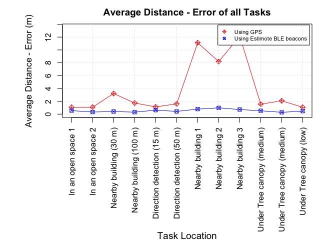

Data and code that reproduce published results in the paper:
Experimental evaluation of using BLE beacon for outdoor positioning in
GPS-denied environment
================
Yousef Qamaz (<y_qama01@uni-muenster.de>), Angela Schwering
(<schwering@uni-muenster.de>), Janina Bistron (<bistron.wwu@gmail.com>)

# Preliminaries

### Loading data

``` r
# read measured distances using GPS
gps_dis_app = read.csv('data/ds_gps_app.csv',header=TRUE, sep=",")
# read actual distances using measurement tape (when tasks were achieved using GPS)
gps_dis_real = read.csv('data/ds_gps_real.csv',header=TRUE, sep=",")
# read measured distances using BLE beacons
ble_dis_app = read.csv('data/ds_ble_app.csv',header=TRUE, sep=",")
# read actual distances using measurement tape (when tasks were achieved using BLE beacons)
ble_dis_real = read.csv('data/ds_ble_real.csv',header=TRUE, sep=",")
```

#### Calculating distance-error of all tasks using GPS and BLE beacons

``` r
# calculating GPS distance-error 
gps_dis_error = abs(gps_dis_app[,-c(1)] - gps_dis_real[,-c(1)])
# update dataframe header
colnames(gps_dis_error) = paste("GPS Dis. Error T", 1:12, sep="")
players = c(1:9)
gps_dis_error <- cbind(players, gps_dis_error)

# calculating BLE beacons distance-error  
ble_dis_error = abs(ble_dis_app[,-c(1)] - ble_dis_real[,-c(1)])
# update dataframe header
colnames(ble_dis_error) = paste("BLE Dis. Error T", 1:12, sep="")
players = c(1:9)
ble_dis_error <- cbind(players, ble_dis_error)
```

#### Calculating mean distance-error

``` r
# gps
mean_gps_dis_error <- colMeans(gps_dis_error[,-c(1)], na.rm = TRUE)
# ble beacons
mean_ble_dis_error <- colMeans(ble_dis_error[,-c(1)], na.rm = TRUE)
```

# 4.4 Results

> Figure 4

``` r
tasks_labels = c(  
  "In an open space 1", 
  "In an open space 2",
  "Nearby building (30 m)",
  "Nearby building (100 m)",
  "Direction detection (15 m)",
  "Direction detection (50 m)",
  "Nearby building 1",
  "Nearby building 2",
  "Nearby building 3",
  "Under Tree canopy (medium)",
  "Under Tree canopy (medium)",
  "Under Tree canopy (low)"
)

mean_gps_error_list = c(
  mean_gps_dis_error[1],
  mean_gps_dis_error[6],
  mean_gps_dis_error[9],
  mean_gps_dis_error[12],
  mean_gps_dis_error[2],
  mean_gps_dis_error[11],
  mean_gps_dis_error[7],
  mean_gps_dis_error[10],
  mean_gps_dis_error[8],
  mean_gps_dis_error[3],
  mean_gps_dis_error[4],
  mean_gps_dis_error[5]
)

mean_ble_error_list = c(  
  mean_ble_dis_error[1],
  mean_ble_dis_error[6],
  mean_ble_dis_error[9],
  mean_ble_dis_error[12],
  mean_ble_dis_error[2],
  mean_ble_dis_error[11],
  mean_ble_dis_error[7],
  mean_ble_dis_error[10],
  mean_ble_dis_error[8],
  mean_ble_dis_error[3],
  mean_ble_dis_error[4],
  mean_ble_dis_error[5]
)

## plotting results
par(mfcol=c(1,1), mai=c(2.55,1.3,0.5,0.5))
plot(c(1:12),mean_gps_error_list, xaxt = "n", ylab = "", 
     xlab = "", main= "Average Distance - Error of all Tasks", col = 'red', pch = 9, ylim=c(0,13.5))
title(ylab="Average Distance - Error (m)", line=3, cex.lab=1.1)
title(xlab="Task Location", line=11.8, cex.lab=1.2)
axis(1, at=1:12,  labels=tasks_labels, las=2)
lines(c(1:12),mean_gps_error_list, lty=1, lwd=1, col="red")
points(c(1:12),mean_ble_error_list, col="blue", pch = 7)
lines(c(1:12),mean_ble_error_list,lty=1,lwd=1,col="blue")
legend('topright', legend=c("Using GPS", "Using Estimote BLE beacons"),
       col=c("red", "blue"), pch = c(9, 7), cex=0.7, inset=0.01, lwd=c(NA, NA, 2))
grid()
```


